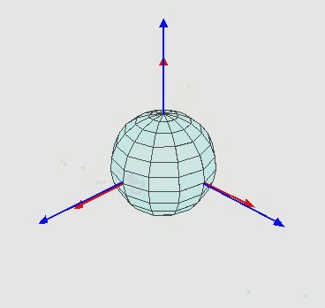

[toc]

# 3维物体旋转

## 欧拉角

欧拉角是用来唯一地确定定点转动刚体位置的三个一组独立角参量，由章动角θ/α、进动角ψ/β和自转角φ/γ组成。

设`(x, y, z)`为全局坐标，`(X, Y, Z)`为局部坐标，旋转步骤为：1-物体绕全局z轴旋转α角；2-绕自身X轴旋转β角；3-绕自身Z轴旋转γ角，欧拉角可以记作：`zXZ-(α, β, γ)`。

**缺点**：万向节死锁（万向节死锁不是说不能旋转了，而是会导致旋转不自然。要规避万向节死锁，需要选择合适的旋转顺序（12种））。
> 平衡环架，为一具有枢纽的装置，使得一物体能以单一轴旋转。由彼此垂直的枢纽轴所组成的一组三只平衡环架，可使在最内的环架上的物体维持旋转轴不变，应用于陀螺仪、罗盘、饮料架等用途上。
> 

欧拉角工作方式与万向节几乎一样，能够提供**桶滚**（最外侧轴转动）、**俯仰**（中间轴转动）、**偏航**（最内侧轴转动）3种自由度。
当船首扬起90度，陀螺仪调节如图（底部三轴向，RGB-XYZ，设船头沿着+Z）：
此时船体再次发生转动，沿+Z旋转，将发生：


> 参考:https://www.zhihu.com/question/47736315


### threejs中使用欧拉角

欧拉角描述xyz三个方向上的旋转弧度，在threejs中使用`rotation.x/y/z`直接设置使用。

## 四元数

四元数由复数集扩展而来。如同**复数**可以用于描述二维复平面上任意一点的旋转（旋转数$q=cosθ+sinθ*i$，复数$i^2=-1$），四元数相比于复数额外增加了2个虚部，可以用于描述三维空间中任意一点的旋转并且没有死锁问题。

四元数具有的**独特性质**：
$$
i^2=j^2=k^2=ijk=-1\\
ij=k jk=i ki=j\\
ji=-k kj=-i ik=-j
$$
四元数的几种**描述方法**：
$$
q=s+xi+yj+zk\\
q=[s, xi+yj+zk]\\
q=[s, \vec v]
$$
四元数旋转数：$q=[cosθ+sinθ*\vec v]$

> 四元数运算及差值slerp参考：https://www.qiujiawei.com/understanding-quaternions/
> 欧拉角&四元数使用方法：https://www.cnblogs.com/vadim-web/p/13379203.html

### 在threejs中使用四元数

四元数封装在`THREE.Quaternion`中，有很多设置方法。注意四元数对象与欧拉对象都用于保存对象旋转信息，连续两次设置将会产生覆盖。

```js
// 使用v_from与v_to向量旋转物体
object.quaternion.setFromUnitVectors(vFrom.normalize(), vTo.normalize());

// 使用旋转轴与旋转角度旋转物体
let axis = new THREE.Vector().crossVectors(vFrom, vTo);
let angle = vFrom.angleTo(vTo);
object.quaternion.setFromAxisAngle(axis, angle);
```